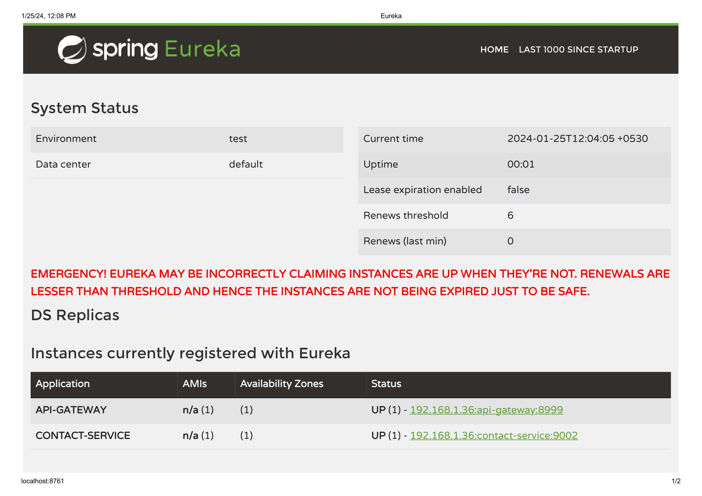

# MicroServices
Small Devops Project using SpringBoot
Microservice project for an e-
commerce. Create User microservice with
UserId, Name, Mobile, Contact.
1-create a folder mservice
2-open eclipse
3.spring boot Tool installed in eclipse
4-create a user_service @https://start.spring.io/
Project Maven Language Java
springboot 3.0.1
Group com.user
Artifact user_service
Name user_service
Description This is microservice for User
PackageName com.user
Packaging Jar
Java 19
Dependencies-Spring Web
5.Extract Generated zip @mservice

  
 

6.in src/main/resources/application-properties
set server.port=9001
7.create new class in src/main/java/com/user/entity/User.java
package com.user.entity;
import java.util.ArrayList;
import java.util.List;
public class User {
private Long userId;
private String name;
private String phone;
List<Contact> contacts = new ArrayList<>();
public User(Long userId, String name, String phone) {
this.userId = userId;
this.name = name;
this.phone = phone;
}
public User(Long userId, String name, String phone, List<Contact> contacts) {
this.userId = userId;
this.name = name;
this.phone = phone;
this.contacts = contacts;
}

  
public User() {}
public Long getUserId() {
return userId;
}
public void setUserId(Long userId) {
this.userId = userId;
}
public String getName() {
return name;
}
public void setName(String name) {
this.name = name;
}
public String getPhone() {
return phone;
}
public void setPhone(String phone) {
this.phone = phone;
}

  
public List<Contact> getContacts() {
return contacts;
}
public void setContacts(List<Contact> contacts) {
this.contacts = contacts;
}
}
8.Create Contact.java at same location
package com.user.entity;
public class Contact {
private Long cId;
private String email;
private String contactName;
private Long userId;
public Contact(Long cId, String email, String contactName, Long userId) {
this.cId = cId;
this.email = email;
this.contactName = contactName;
this.userId = userId;
}

  
 

public Contact() {
}
public Long getcId() {
return cId;
}
public void setcId(Long cId) {
this.cId = cId;
}
public String getEmail() {
return email;
}
public void setEmail(String email) {
this.email = email;
}
public String getContactName() {
return contactName;
}
public void setContactName(String contactName) {
this.contactName = contactName;
}
public Long getUserId() {
return userId;
}

  
 

public void setUserId(Long userId) {
this.userId = userId;
}
}
9.create new Interface in
src/main/java/com/user/service/UserServiceApplication.java
package com.user;
import org.springframework.boot.SpringApplication;
import org.springframework.boot.autoconfigure.SpringBootApplication;
@SpringBootApplication
public class UserServiceApplication {
public static void main(String[] args) {
SpringApplication.run(UserServiceApplication.class, args);
}
}
9.1 Also create an implementation class at same location (UserServiceImpl.java)
package com.user.service;
import java.util.List;
import org.springframework.stereotype.Service;

  
import com.user.entity.User;
@Service
public class UserServiceImpl implements UserService {
List<User> list = List.of(
new User(1001L,"Suraj","1234567890"),
new User(1002L,"Ravi","1234512345"),
new User(1003L,"Aditya","1234554321"),
new User(1004L,"Bhaskar","1231231230")
);
@Override
public User getUser(Long id) {
return list.stream().filter(user ->user.getUserId().equals(id)).findAny().orElse(null);
}
}
10.create new class in src/main/java/com/user/controller/
package com.user.controller;
import org.springframework.beans.factory.annotation.Autowired;
import org.springframework.web.bind.annotation.GetMapping;
import org.springframework.web.bind.annotation.PathVariable;
import org.springframework.web.bind.annotation.RequestMapping;
import org.springframework.web.bind.annotation.RestController;
//import org.springframework.web.client.RestTemplate;
import com.user.entity.User;

  
 

import com.user.service.UserService;
@RestController
@RequestMapping("/user")
public class UserController {
@Autowired
private UserService userService;
// @Autowired
// private RestTemplate restTemplate;
@GetMapping("/{userId}")
public User getUser(@PathVariable("userId") Long userId) {
User user =this.userService.getUser(userId);
return user;
}
}
Contact microservice with ContactId,
Name, Email, UserId for above microservice.
Ans : create a contact_service @https://start.spring.io/
Project Maven Language Java
springboot 3.0.1
Group com.user
Artifact contact_service
Name contact_service
Description This is microservice for Contact
PackageName com.contact
Packaging Jar
Java 19

  
 

Dependencies-Spring Web
Follow steps similar to user_services
1. in src/main/resources/application-properties
set server.port=9002
2. create new class in src/main/java/com/contact/entity/Contact.java
package com.contact.entity;
public class Contact {
private Long cId;
private String email;
private String contactName;
private Long userId;
public Contact(Long cId, String email, String contactName, Long userId) {
this.cId = cId;
this.email = email;
this.contactName = contactName;
this.userId = userId;
}
public Contact() {

  
}
public Long getcId() {
return cId;
}
public void setcId(Long cId) {
this.cId = cId;
}
public String getEmail() {
return email;
}
public void setEmail(String email) {
this.email = email;
}
public String getContactName() {
return contactName;
}
public void setContactName(String contactName) {
this.contactName = contactName;

  
 

}
public Long getUserId() {
return userId;
}
public void setUserId(Long userId) {
this.userId = userId;
}}
3. create new Interface in src/main/java/com/contact/service/ ContactService.java
package com.contact.service;
import java.util.List;
import com.contact.entity.Contact;
public interface ContactService {
public List<Contact> getContactsOfUser(Long userId);
}
4. Also create an implementation class at same location (ContactServiceImpl.java)
package com.contact.service;
import java.util.List;
import java.util.stream.Collectors;

  
import com.contact.entity.Contact;
import org.springframework.stereotype.Service;
@Service
public class ContactServiceImpl implements ContactService{
List<Contact> list =List.of(
new Contact(2001L,"asda@asd","Suraj",1001L),
new Contact(2002L,"asda@asd11","Suraj01",1001L),
new Contact(2003L,"asda40@asd","Suraj02",1001L),
new Contact(2004L,"asda@asd","Ravi",1002L),
new Contact(2005L,"asda@asd","Ravi01",1002L)
);
@Override
public List<Contact> getContactsOfUser(Long userId) {
return list.stream().filter(contact ->
contact.getUserId().equals(userId)).collect(Collectors.toList());
}
}

  
5. create new class in src/main/java/com/contact/controller/ContactController.java
package com.contact.controller;
import com.contact.entity.Contact;
import com.contact.service.ContactService;
import java.util.List;
import org.springframework.beans.factory.annotation.Autowired;
import org.springframework.web.bind.annotation.GetMapping;
import org.springframework.web.bind.annotation.PathVariable;
import org.springframework.web.bind.annotation.RequestMapping;
import org.springframework.web.bind.annotation.RestController;
@RestController
@RequestMapping("/contact")
public class ContactController {
@Autowired
private ContactService contactService;
@GetMapping("/user/{userId}")
public List<Contact> getContact(@PathVariable("userId") Long userId){
return this.contactService.getContactsOfUser(userId);
}}

  
 

APIGateway and Eserver(Service
Discovery) for the above microservice.
1.Create APIGateway @https://start.spring.io/
Project Maven Language Java
springboot 3.0.1
Group com.apigateway
Artifact apigateway
Name apigateway
Description This is microservice for api gateway
PackageName com.apigateway
Packaging Jar
Java 19
Dependencies-Gateway,Eureka Discovery Client,Spring Boot Actuator
a.Application.yml
server:
port: 8999
eureka:
instance:
hostname: localhost
spring:
application:
name: api-gateway
cloud:
gateway:
routes:
- id: user-service
uri: lb://user-service
predicates:
- Path=/user/**

  
 

- id: contact-service
uri: lb://contact-service
predicates:
- Path=/contact/**
b.ApigatewayApplication.Java
package com.apigateway;
import org.springframework.boot.SpringApplication;
import org.springframework.boot.autoconfigure.SpringBootApplication;
import org.springframework.cloud.client.discovery.EnableDiscoveryClient;
@SpringBootApplication
@EnableDiscoveryClient
public class ApigatewayApplication {
public static void main(String[] args) {
SpringApplication.run(ApigatewayApplication.class, args);
}
}
2.Create Eserver using Eureka Netflix Server
a. Application.yml
server:
port: 8761
eureka:
client:
register-with-eureka: false
fetch-registry: false
server:
wait-time-in-ms-when-sync-empty: 0
instance:
hostname: localhost

  
 

b. EserverApplication.java
package com.eserver;
import org.springframework.boot.SpringApplication;
import org.springframework.boot.autoconfigure.SpringBootApplication;
import org.springframework.cloud.netflix.eureka.server.EnableEurekaServer;
@SpringBootApplication
@EnableEurekaServer
public class EServerApplication {
public static void main(String[] args) {
SpringApplication.run(EServerApplication.class, args);
}
}
After Running all the services we can check it at localhost:8761

 
